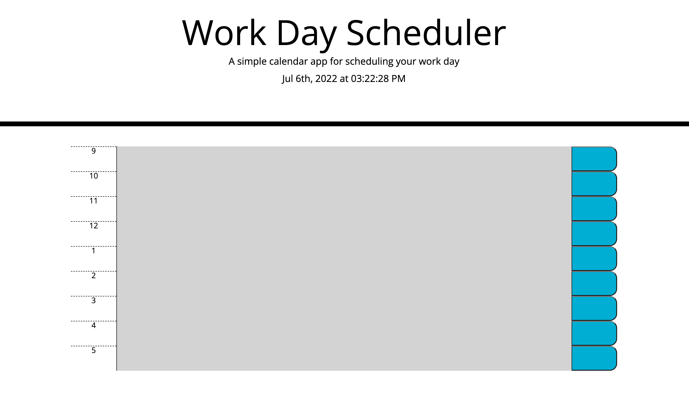

# daily_planner

## Description

This is a webpage that allows the user to input a task for each hour of the work day in order to keep track of what needs to be done that day.

- User is presented with a screen that has the current time and 8 color coded time blocks for the work day
- upon clicking into any of the text areas the user can input their own data
- upon clicking the save button for that text area the data should be saved into local storage and represented in that same text area.

## Tasks Completed

- paired text areas with pre-written css and added custom html
- created dynamic javascript elements with unique data-ids 

## Usage

To view the project follow the link attached to be taken to the live url.

- Url: [https://t-rummy.github.io/daily-planner/] (https://t-rummy.github.io/daily-planner/)

-  Github Repository: [https://github.com/T-rummy/daily-planner](https://github.com/T-rummy/daily-planner)

## Credits

- [https://coding-boot-camp.github.io/full-stack/github/professional-readme-guide](https://coding-boot-camp.github.io/full-stack/github/professional-readme-guide)

## Screenshot 

 